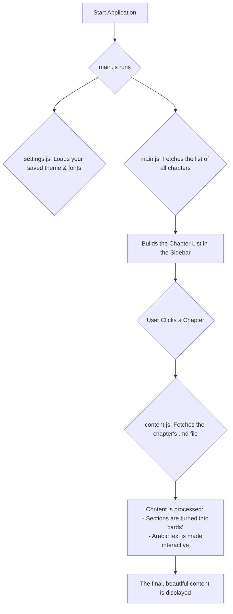

# maktab

An interactive website for learning about the Quran. This project provides clear, simple notes on Tajwid (recitation rules) and basic Islamic studies. With beautiful visuals and animations, it's designed like an animated book to make learning easy and fun for everyone.

---

## How It Works (A Visual Guide)

The project has a simple, logical flow. When you open the website, it loads the chapter list, and when you click a chapter, it displays the content. This chart shows the process:



---

## How to Customize

This project is designed to be easy to modify, even without programming knowledge.

### Adding or Modifying Chapters

All the content lives inside the `chapters` folder. Follow these steps to add your own content:

1.  **Create a Content File:** In the `chapters` folder, create a new text file and give it a name, for example: `my-new-lesson.md`. The `.md` at the end is important.

2.  **Write Your Content:** Open the new file and write your lesson. You can use simple formatting:
    *   To create a new "card" or section on the page, just type `---` on its own line.
    *   To create a main heading, use `# Main Heading`.
    *   To create a sub-heading that appears in the sidebar navigation, use `## Sidebar Title` followed by `### Content Title`. The `##` title will show in the sidebar, but will be hidden from the main page.

3.  **Add it to the List:** Open the `chapters/chapters.json` file. This file contains the master list of all chapters. Add a new line for your new file, following the same format:

    ```json
    {
      "chapters": [
        { "title": "Chapter One", "file": "01-intro.md" },
        { "title": "Chapter Two", "file": "02-letters.md" },
        { "title": "My New Lesson", "file": "my-new-lesson.md" }
      ]
    }
    ```

That's it! Refresh the website, and your new chapter will appear in the sidebar.

---

## Tips for Modifying with an AI Assistant

You can use an AI code assistant (like Gemini Code Assist) to make changes easily. Here are some example prompts you can use:

*   **For Changing Colors:**
    > "In the `css/themes.css` file, find the `.dark-theme` and change the main text color (`--text-main`) to a light blue."

*   **For Changing Fonts:**
    > "In `js/modules/settings.js`, I want to add a new Bengali font called 'Kalpurush' to the dropdown. The font is available on Google Fonts."

*   **For Adding New Features:**
    > "Let's implement the first feature from the `TODO.md` file: 'Add Quranic Examples' to the letter modal. We will need to update the `letterData` object in `js/modules/ui.js` and then display the examples in the modal."
